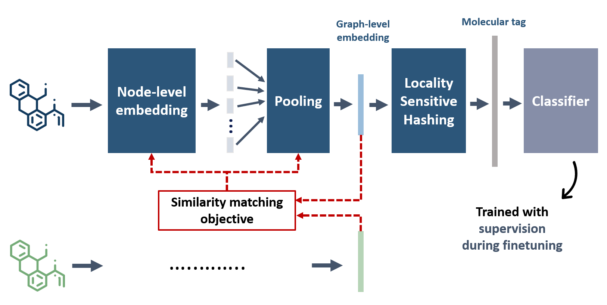

# Code for CSE 8803 (ML with Graphs) project: Pretraining Graph Neural Networks (GNNs) with similarity matching and locality sensitive hashing

This repository contains the code for a GNN pretraining approach I developed for the CSE 8803 (MLG) course at Georgia Tech. The approach relies on a similarity matching objective used to train a GNN for an initial embedding stage, followed by [a locality sensitive hashing (LSH) algorithm](https://www.science.org/doi/10.1126/science.aam9868) developed by Dasgupta et. al (2017). The pipeline for this approach is shown below.

Preliminary analyses of this approach on the [OGB-MolPCBA dataset](https://ogb.stanford.edu/docs/graphprop/#ogbg-mol) show advantages in terms of building structured representations in the embedding space that are well-separated based on their scaffold structure, as shown below. 

